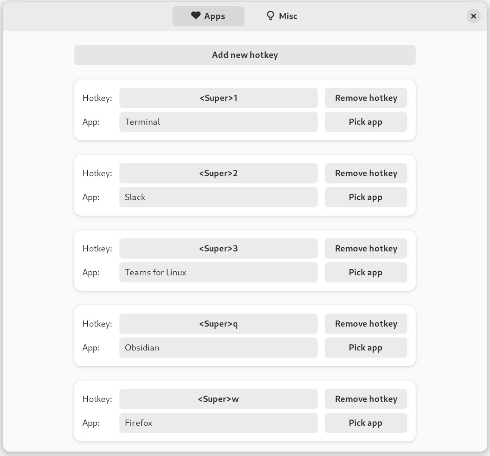

# Happy Appy Hotkey

A GNOME Shell extension that assigns hotkeys to apps to give them focus or launch them.

Get it on [extensions.gnome.org](https://extensions.gnome.org/extension/6057/happy-appy-hotkey/)!

# Features

- Assign a hotkey to an app to
  - Give it focus if it's already running, or
  - Launch it if it's not.
- Assign a hotkey to cycle through all the apps that don't have a hotkey
- Optionally restrict hotkeys to current workspace
- Supports Wayland

# Motivation

I'm a keyboard oriented person and I like to use it to switch apps. However, I think Alt+Tab is too slow and imprecise, especially if you want to jump to a specific app that isn't the last one that you used.

Previously, I cobbled together a few scripts that do this, but they use tools that don't work on Wayland. To achieve this in Wayland, it must operate directly on the window manager (Mutter), and to do that, you need a GNOME Shell extension.

Tiling window managers (like [AwesomeWM](https://awesomewm.org/) and [QTile](http://www.qtile.org/)) provide this too, but they have downsides:

- The rabbit hole of configuring a TWM is _deep_.
- They have more features than I'll ever use, anyway.
- I like the creature comforts of GNOME, where plugging a new keyboard or monitor into my laptop at runtime _just works_.

This extension seeks to fill the niche of what I miss from TWM's in GNOME.

# Building

In order to install this extension locally, run `./build.sh local`.

In order to create a package for upload to extensions.gnome.org, run `./build.sh package`.

# Contributing

I'm open for issues and PRs, but keep in mind that I don't have a lot of time to work on this extension. Therefore, I'll only consider features that I'm likely to use myself; otherwise maintaining them would cost too much time.

# Credits

For this plugin, I took inspiration from:

- tiling window managers
- The [Awesome Tiles](https://extensions.gnome.org/extension/4702/awesome-tiles/) extension for the way it handles hotkey definition
- [ChatGPT](https://chat.openai.com), which, among other things, came up with the name. What can I say.
